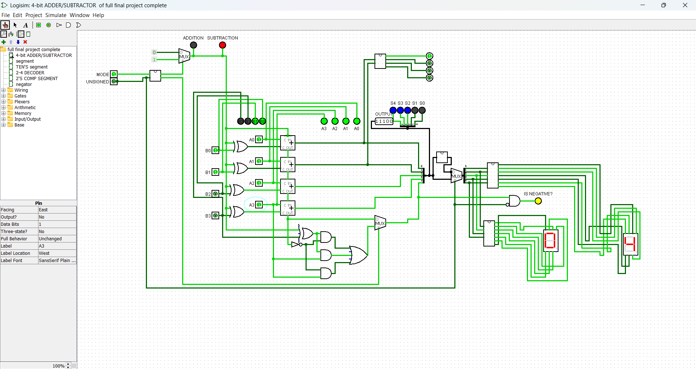

# Enhanced 4-bit Adder

This repository contains a Logisim project that implements an enhanced 4-bit adder-subtractor circuit. The circuit can perform both addition and subtraction on signed and unsigned numbers, and it indicates whether the number is negative or not. Results are shown on two 7-segment component.

## Features

- **Addition and Subtraction:** The circuit can perform both addition and subtraction operations.
- **Signed and Unsigned Operations:** The circuit can handle both signed and unsigned numbers.
- **Negative Number Indication:** The circuit indicates whether the result is negative.
- **7-Segment Display:** The result of the operation is displayed using two 7-segment displays.

## Circuit Details

- **A (A3A2A1A0):** First 4-bit number.
- **B (B3B2B1B0):** Second 4-bit number.
- **Adder-Subtractor.CIRC:** The Logisim file for the 4-bit adder-subtractor circuit.

## Usage

To use the circuit, open the `Adder-Subtractor.CIRC` file in Logisim. You can input the values for A and B and select the operation (addition or subtraction). The result will be displayed on the 7-segment displays.

## Screenshot

## License

This project is licensed under the MIT License.
